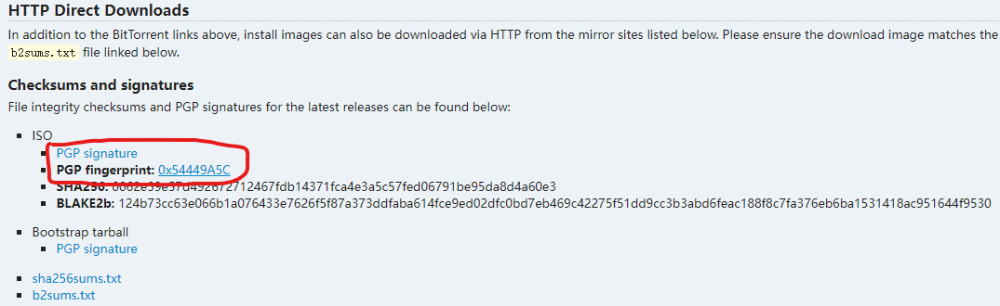
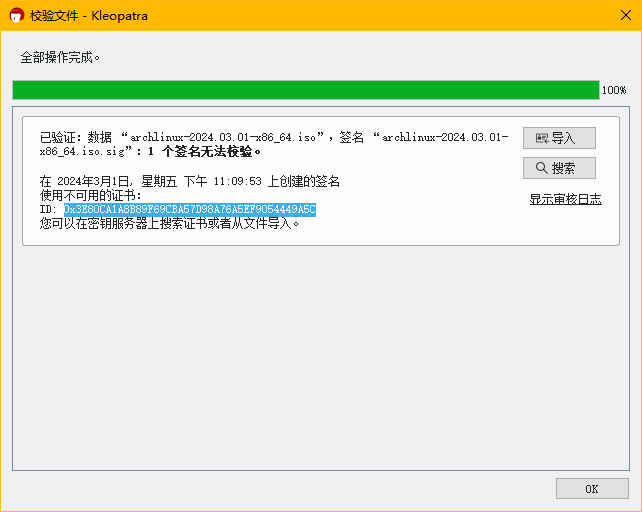

网上的 Archlinux 安装教程已遍布满天飞了。所以这篇文章也仅仅只是整理一下 Arch wiki 安装教程的思路。并不会教你怎么一步步安装 Archlinux。

因为是手动安装，这篇文章也不会使用 `archinstall` 脚本来一键安装。

> 我的文笔可能不是那么的好，也请见谅。

## 下载和校验
在[官网](https://archlinux.org/download/)中下载最新版本的 iso 镜像即可。

为防止镜像不被其他因素修改，建议下载 PGP 签名来进行校验。有关校验步骤已经在[安装指南](https://wiki.archlinuxcn.org/wiki/%E5%AE%89%E8%A3%85%E6%8C%87%E5%8D%97#%E9%AA%8C%E8%AF%81%E7%AD%BE%E5%90%8D)上写的很清楚了。如果不想导入并认证 Archlinux 的指纹。可以在校验后将**错误**信息中的指纹 ID 与 Archlinux 官方指纹 ID 做比对。若比对结果一致即为未修改过的镜像。




## 安装盘安装
### 关闭安全启动
Archlinux 默认不支持安全启动。在安装前记得将安全启动关闭。如果你实在想使用安全启动可在**安装后**参阅[UEFI/安全启动](https://wiki.archlinuxcn.org/wiki/UEFI/%E5%AE%89%E5%85%A8%E5%90%AF%E5%8A%A8)。截至 22.04，Ubuntu 是使用由 Microsoft 签名的 [Shim](https://wiki.archlinuxcn.org/wiki/UEFI/%E5%AE%89%E5%85%A8%E5%90%AF%E5%8A%A8#shim) 来实施安全启动的。

> **注意：将安全启动调整为设置模式是危险行为。可能会导致安全启动损坏！在写入安全启动密钥时一定要谨慎操作。**

### 联网
正常情况下，安装盘会通过 DHCP 自动连接至互联网。如果使用 WI-FI、PPPoE 拨号等。则可能需要阅读[连接到互联网](https://wiki.archlinuxcn.org/wiki/%E5%AE%89%E8%A3%85%E6%8C%87%E5%8D%97#%E8%BF%9E%E6%8E%A5%E5%88%B0%E4%BA%92%E8%81%94%E7%BD%91)。可以的话。使用 [timedatectl](https://wiki.archlinuxcn.org/wiki/%E5%AE%89%E8%A3%85%E6%8C%87%E5%8D%97#%E6%9B%B4%E6%96%B0%E7%B3%BB%E7%BB%9F%E6%97%B6%E9%97%B4) 设置时区。

### 分区
阅读[创建硬盘分区](https://wiki.archlinuxcn.org/wiki/%E5%AE%89%E8%A3%85%E6%8C%87%E5%8D%97#%E5%BB%BA%E7%AB%8B%E7%A1%AC%E7%9B%98%E5%88%86%E5%8C%BA)，[格式化分区](https://wiki.archlinuxcn.org/wiki/%E5%AE%89%E8%A3%85%E6%8C%87%E5%8D%97#%E6%A0%BC%E5%BC%8F%E5%8C%96%E5%88%86%E5%8C%BA)。最后[挂载分区](https://wiki.archlinuxcn.org/wiki/%E5%AE%89%E8%A3%85%E6%8C%87%E5%8D%97#%E6%8C%82%E8%BD%BD%E5%88%86%E5%8C%BA)。关于更详细的分区介绍，可参阅[分区方案](https://wiki.archlinuxcn.org/wiki/%E5%88%86%E5%8C%BA#%E5%88%86%E5%8C%BA%E6%96%B9%E6%A1%88)。

请给准备安装 Archlinux 的分区挂载到系统中。在教程里是指引你挂载到 `/mnt` 下的。在后续安装步骤中最好检查好是否有挂载到分区。

### 安装
从[选择镜像站](https://wiki.archlinuxcn.org/wiki/%E5%AE%89%E8%A3%85%E6%8C%87%E5%8D%97#%E9%80%89%E6%8B%A9%E9%95%9C%E5%83%8F%E7%AB%99)开始一直阅读到[安装引导程序](https://wiki.archlinuxcn.org/wiki/%E5%AE%89%E8%A3%85%E6%8C%87%E5%8D%97#%E5%AE%89%E8%A3%85%E5%BC%95%E5%AF%BC%E7%A8%8B%E5%BA%8F)结束。即阅读完[开始安装系统](https://wiki.archlinuxcn.org/wiki/%E5%AE%89%E8%A3%85%E6%8C%87%E5%8D%97#%E5%BC%80%E5%A7%8B%E5%AE%89%E8%A3%85%E7%B3%BB%E7%BB%9F)和[配置系统](https://wiki.archlinuxcn.org/wiki/%E5%AE%89%E8%A3%85%E6%8C%87%E5%8D%97#%E9%85%8D%E7%BD%AE%E7%B3%BB%E7%BB%9F)两大章节。

> [安装引导程序](https://wiki.archlinuxcn.org/wiki/%E5%AE%89%E8%A3%85%E6%8C%87%E5%8D%97#%E5%AE%89%E8%A3%85%E5%BC%95%E5%AF%BC%E7%A8%8B%E5%BA%8F)可以不着急阅读。会在下一节里讲。

#### 一些需要注意的点
- 在 GPT 分区表下[生成 fstab 文件](https://wiki.archlinuxcn.org/wiki/%E5%AE%89%E8%A3%85%E6%8C%87%E5%8D%97#%E7%94%9F%E6%88%90_fstab_%E6%96%87%E4%BB%B6)时，最好使用 UUID 格式来设置。因为你的系统盘不一定每一次都会是 `/dev/sda`。
- `arch-chroot` 以后，就是正在模拟你刚刚安装的系统。此时安装软件就不要使用 `pacstrap` 了。`pacstrap` 是用来初始化新系统的。

### 引导
启动操作系统最重要的一步就是需要一个正常的引导程序。阅读[引导加载程序功能比较](https://wiki.archlinuxcn.org/wiki/Arch_%E7%9A%84%E5%90%AF%E5%8A%A8%E6%B5%81%E7%A8%8B#%E5%8A%9F%E8%83%BD%E6%AF%94%E8%BE%83)可查阅 Archlinux 支持哪些引导程序。一般来说，GRUB 是最欢迎且兼容性最好的引导程序。

> 安装引导的步骤仍需要在 `arch-chroot` 模拟下安装。

#### 安装 GRUB
如果是 UEFI 模式，阅读[UEFI 系统](https://wiki.archlinuxcn.org/wiki/GRUB#UEFI_%E7%B3%BB%E7%BB%9F)。如果是传统模式，阅读[BIOS 系统](https://wiki.archlinuxcn.org/wiki/GRUB#BIOS_%E7%B3%BB%E7%BB%9F)。

安装后，[生成 GRUB 配置文件](https://wiki.archlinuxcn.org/wiki/GRUB#%E7%94%9F%E6%88%90_grub.cfg)。

安装完 GRUB 后。你的操作系统就可以正常启动了。

### 其他软件
如果你想在启动前安装其他软件。可使用 `pacman -S <软件包1> <软件包2> <软件包3> <软件包...>` 来安装。

#### 例如
- 管理 `ext4` 和 `NTFS` 的[文件系统](https://wiki.archlinuxcn.org/wiki/%E6%96%87%E4%BB%B6%E7%B3%BB%E7%BB%9F)
- 网络管理器 [NetworkManager](https://wiki.archlinuxcn.org/wiki/NetworkManager)，注意不要和其他网络管理器冲突了。如果需要开机自启动网络服务，可在**重启到系统后**使用 `systemctl enable --now NetworkManager` 开启开机自启。
- 文本编辑器 vim 或 nano。vim 更快捷，nano 更方便。
- man 和 info 手册

## 后续安装
至此，前期安装工作完毕。记得退出 `arch-chroot` 模拟。重启电脑并弹出安装盘。进入你全新的 Archlinux系统。后续步骤建议参阅[建议阅读](https://wiki.archlinuxcn.org/wiki/%E5%BB%BA%E8%AE%AE%E9%98%85%E8%AF%BB)。以下内容为[建议阅读](https://wiki.archlinuxcn.org/wiki/%E5%BB%BA%E8%AE%AE%E9%98%85%E8%AF%BB)的部分内容解析。

### 用户和组
正常来说，刚刚的安装步骤只创建了 `root` 用户。这是不安全的行为。应该创建一个普通用户来作为日常管理等使用。关于如何创建新用户，参阅[添加登录用户](https://wiki.archlinuxcn.org/wiki/%E7%94%A8%E6%88%B7%E5%92%8C%E7%94%A8%E6%88%B7%E7%BB%84#%E6%B7%BB%E5%8A%A0%E7%99%BB%E5%BD%95%E7%94%A8%E6%88%B7)。为了安全，建议不要将用户目录赋予组写入权限。

> 更正确的说法是只修改了 root 用户的密码，为了不让萌新混淆才这么说的。

### sudo
将用户添加至 `wheel` 组后重启计算机即可使用 `sudo` 命令。关于如何将用户加入组，参阅[其他用户管理示例](https://wiki.archlinuxcn.org/wiki/%E7%94%A8%E6%88%B7%E5%92%8C%E7%94%A8%E6%88%B7%E7%BB%84#%E5%85%B6%E4%BB%96%E7%94%A8%E6%88%B7%E7%AE%A1%E7%90%86%E7%A4%BA%E4%BE%8B)。添加至组后需重启才能生效。

默认情况下 sudo 没有启用 `wheel` 组的权限，如果需要启用，可以通过 `visudo` 命令将
```sudoers
# %wheel ALL=(ALL:ALL) ALL
```
取消注释。以后只需要将用户添加到 `wheel` 组即可。

> 非必要，不要随意编辑 `/etc/sudoers` 文件或使用 `visudo` 命令。

### yay
Archlinux 有个强大的第三方软件库 AUR。软件库内的软件均有用户上传安装。如果想使用 AUR。可参阅 [yay](https://github.com/Jguer/yay)。

### GNOME
GNOME 是一个追求简单易用的桌面环境。关于如何安装 GNOME，参阅 [GNOME 安装](https://wiki.archlinuxcn.org/wiki/GNOME)即可。

文中[运行 GNOME/图形界面启动](https://wiki.archlinuxcn.org/wiki/GNOME#%E5%9B%BE%E5%BD%A2%E7%95%8C%E9%9D%A2%E5%90%AF%E5%8A%A8)表达有些许错误。直接 enable gdm.service 可能会导致 GNOME 卡死。如果想开机自启动 GNOME，最好的方法是 `ln -sf /usr/lib/systemd/system/gdm.service /etc/systemd/system/display-manager.service`。

> 在[建议阅读](https://wiki.archlinuxcn.org/wiki/%E5%BB%BA%E8%AE%AE%E9%98%85%E8%AF%BB)中，[图形界面](https://wiki.archlinuxcn.org/wiki/%E5%BB%BA%E8%AE%AE%E9%98%85%E8%AF%BB#%E5%9B%BE%E5%BD%A2%E7%95%8C%E9%9D%A2)介绍了太多内容。其实只需要安装一个桌面环境（如 GNOME, KDE 等）即可安装完完整的图形界面服务。无需一个一个安装。

#### IBus
如果使用 GNOME，则建议使用 IBus 作为默认中文输入法，详细安装教程可阅读[维基](https://wiki.archlinuxcn.org/wiki/IBus)

## 结尾
至此。Archlinux 安装的差不多了。但是你的 Archlinux 之路才刚刚开始。如果想了解更多软件包的使用教程及信息，可以通过[建议阅读](https://wiki.archlinuxcn.org/wiki/%E5%BB%BA%E8%AE%AE%E9%98%85%E8%AF%BB)进行学习，如果想要深入学习 Archlinux，可以通过学习 [ArchWiki](https://wiki.archlinuxcn.org/) 来深入学习。